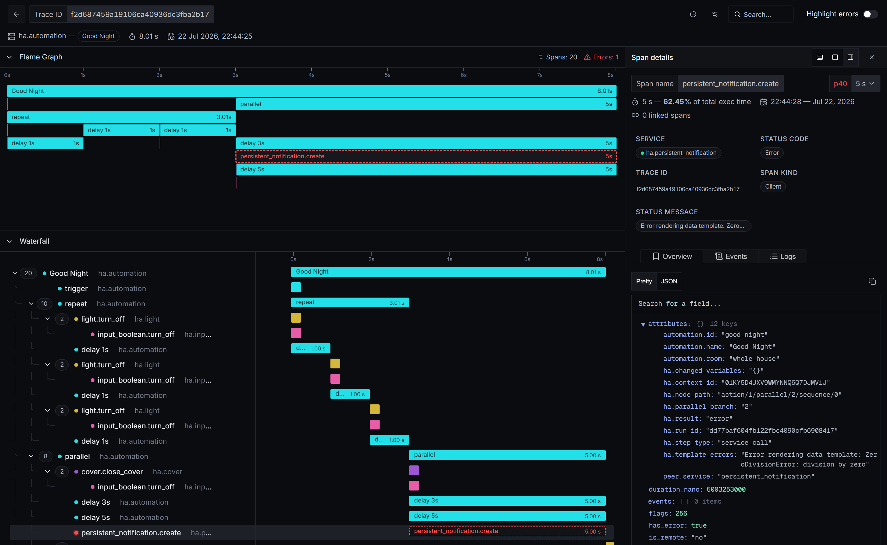
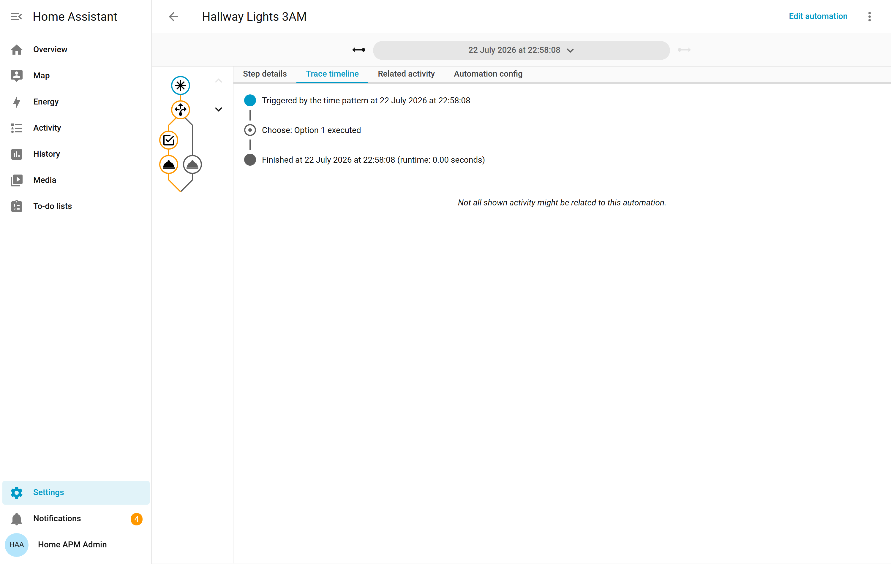
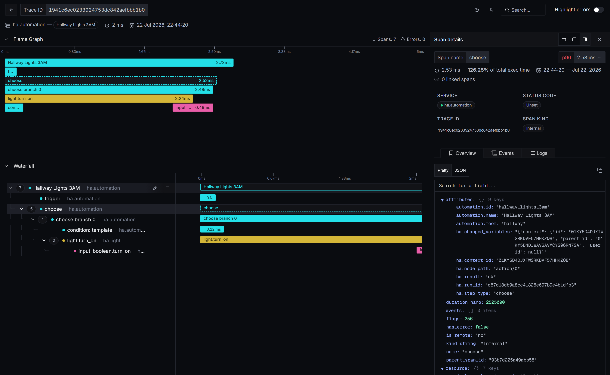
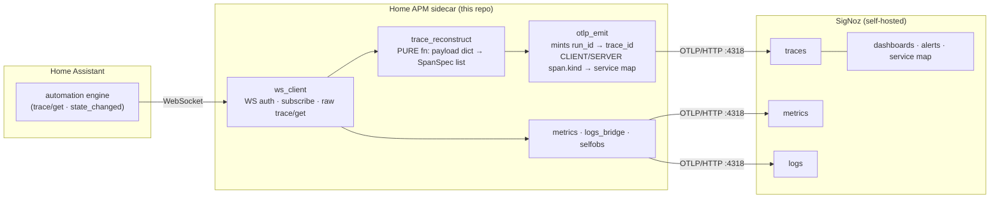
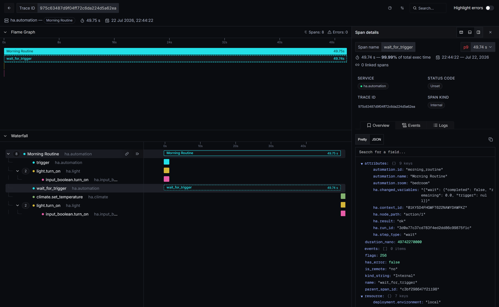
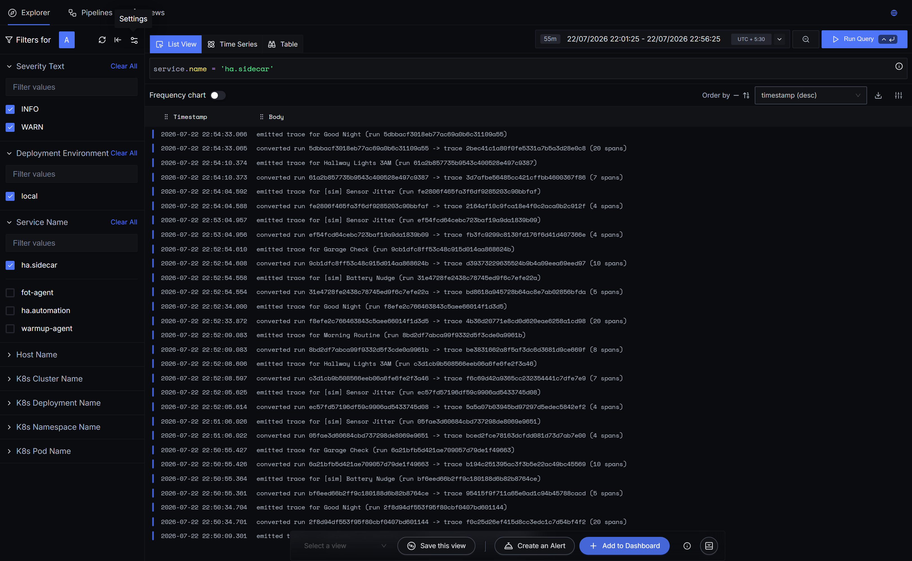
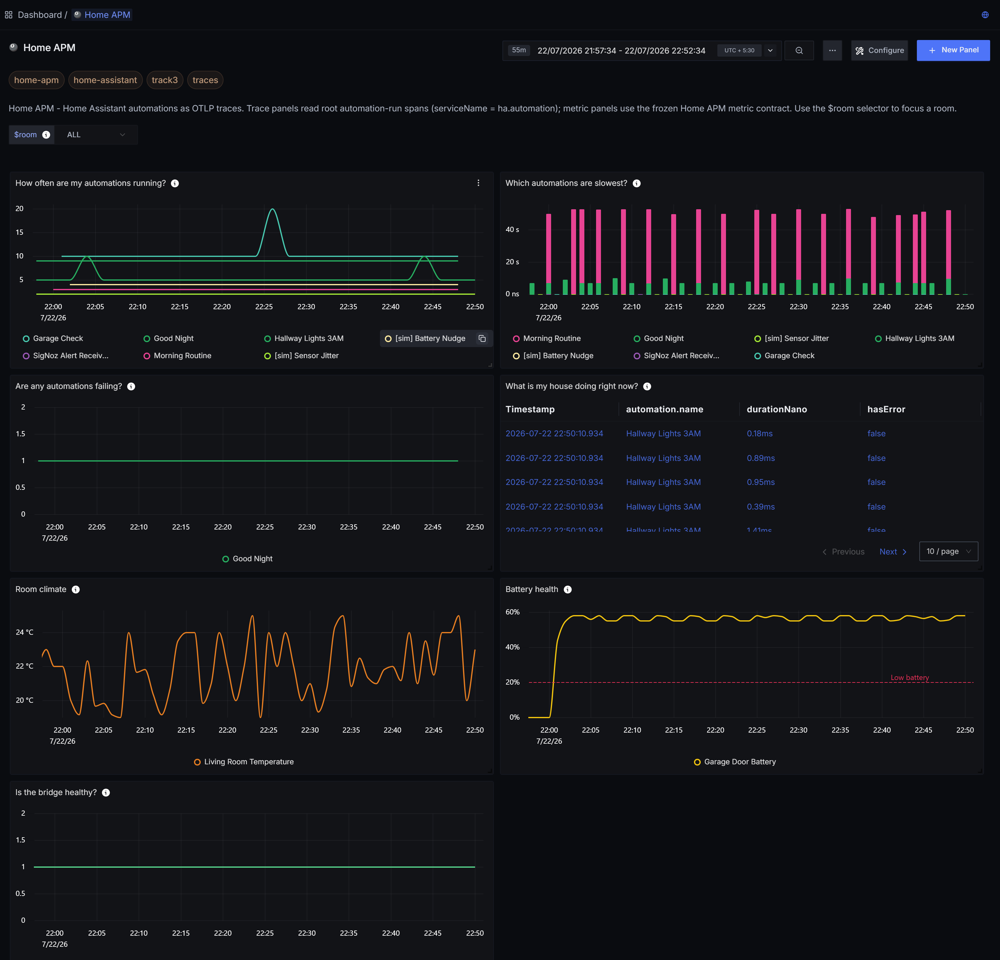
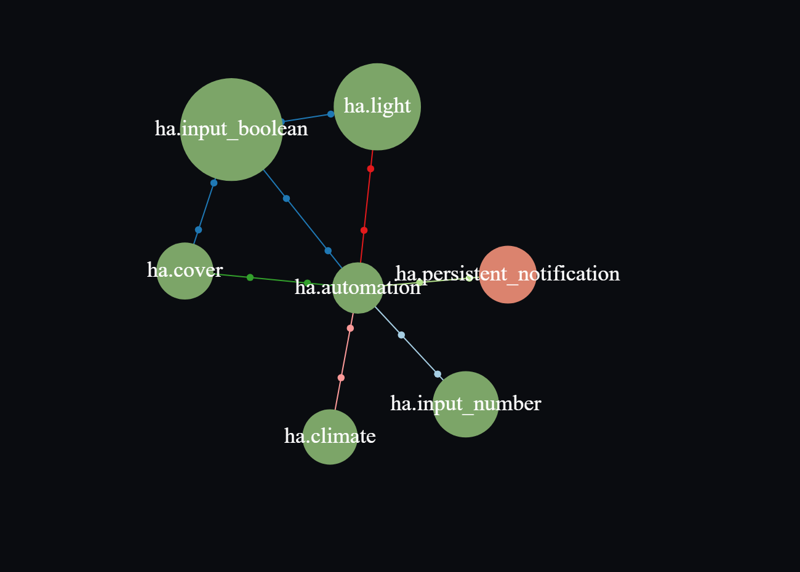
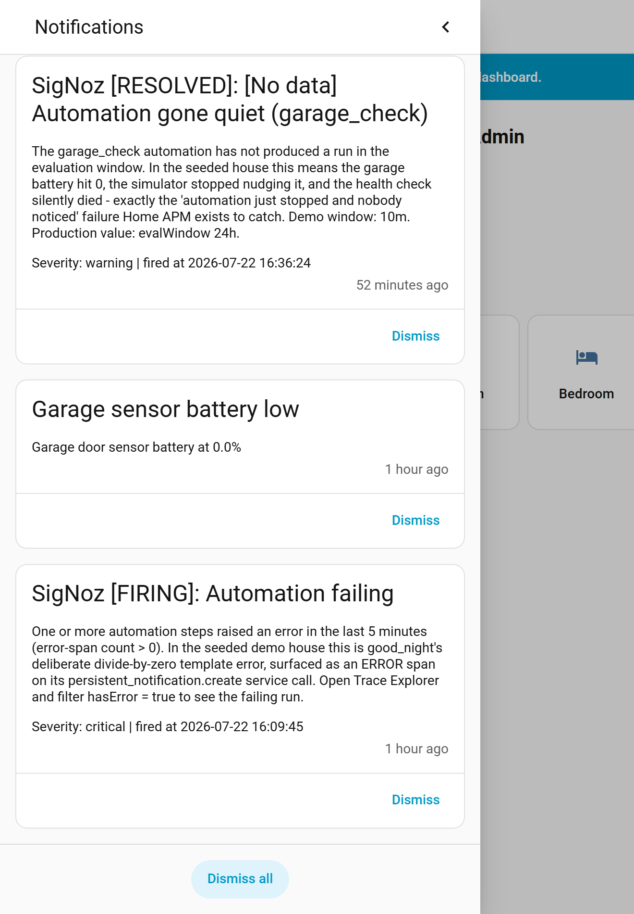
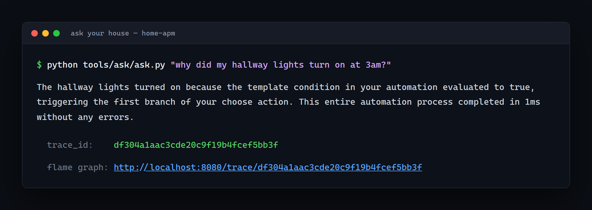

# Home APM — an APM for your house

[](https://github.com/wiz-abhi/Home-APM/actions/workflows/ci.yml)

**Home Assistant has always recorded automation traces — it just never let
anyone actually see them.** Home APM is a small Python sidecar that subscribes
to Home Assistant's WebSocket API, pulls each automation run's raw `trace/get`
payload, reconstructs it into an OpenTelemetry span tree, and exports it to a
self-hosted **SigNoz** over OTLP. Every automation run becomes a legible flame
graph — the cryptic `conditions/0/conditions/1/conditions/0` node paths turn
into named, clickable spans — alongside sensor metrics, a room dashboard, and
alerts that loop back into Home Assistant. Home Assistant has **no native
OpenTelemetry trace export**; this is that missing export.



*The `good_night` automation, reconstructed: a `repeat` loop (three stacked
iterations), a `parallel` block (overlapping bars), and a red **ERROR** span on
`persistent_notification.create` — its `ha.template_errors` reads
`ZeroDivisionError: division by zero`. This is real automation telemetry that
Home Assistant stores but cannot render.*

---

## The Real Problem

> Home Assistant is not a niche hobby project: the Open Home Foundation's *State
> of the Open Home 2025* reports **over 2,000,000 active installations**. And
> those two million users share one specific, documented pain — reading
> automation traces. In a community thread with 22 replies, a self-identified
> professional developer calls Home Assistant's built-in trace view **"mostly
> useless"**: node paths render as cryptic strings like
> `conditions/0/conditions/1/conditions/0`, the graph can't be scrolled, you
> can't click a node you can't see, and the logbook comes up empty. Worse, Home
> Assistant keeps only about five traces per automation, so the run you actually
> need is often already gone — *"Chosen trace is no longer available."* The
> demand for a fix is explicit: a separate thread asks, verbatim, whether Home
> Assistant can export its traces to an OpenTelemetry Collector — a change one
> user calls a **"tremendous benefit"** — and today there is no solution,
> because **Home Assistant has no native OpenTelemetry trace export at all.**
> Home APM is that missing export: it turns every automation run into a legible
> SigNoz flame graph, and it persists every raw trace to disk so the run you
> needed is never gone.

Sources: [State of the Open Home 2025](https://www.home-assistant.io/blog/2025/04/16/state-of-the-open-home-2025/)
· [community thread 767431 ("mostly useless")](https://community.home-assistant.io/t/767431)
· [community thread 795531 (asks for OTel export)](https://community.home-assistant.io/t/795531)

### Before / after — the same automation, two tools

| Home Assistant's native trace view | The same automation in SigNoz |
|---|---|
|  |  |
| Icon-only node graph, no per-step durations, `runtime: 0.00 seconds`, and "Not all shown activity might be related to this automation." | A named waterfall: `trigger → choose → choose branch 0 → condition: template → light.turn_on`, each span timed, with `ha.step_type`, `ha.result`, and `ha.node_path` on the side panel. |

That is the whole pitch in one row: Home Assistant already *has* this data. Home
APM makes it legible.

---

## Architecture



The reconstruction (`src/homeapm/trace_reconstruct.py`) is a **pure, I/O-free
function**: a `trace/get` payload dict in, a `list[SpanSpec]` out. Nothing about
it touches the network — which is exactly what makes it golden-testable offline:
**clone and `pytest`, no house required.** The other modules are the thin I/O
shell around it (`ws_client` for the socket, `otlp_emit` for the exporter,
`metrics`/`logs_bridge`/`selfobs` for the non-trace signals).

The span schema is frozen (renaming a key would break the dashboard, the alerts,
and "ask your house" at once):

```
service.name  ha.automation (root, SERVER)  ·  ha.light / ha.climate / ha.cover /
              ha.input_boolean / ha.input_number / ha.persistent_notification
              (service-call children, CLIENT, peer.service = target domain)
span attrs    automation.name · automation.id · automation.room · ha.node_path ·
              ha.step_type {trigger|condition|choose|sequence|wait|repeat|
              parallel|service_call} · ha.context_id · ha.run_id · ha.result ·
              ha.changed_variables · ha.template_errors · + otel status/error
trace_id      minted by the sidecar per run; the sidecar owns the run_id→trace_id map
```

The deliberate `CLIENT`/`SERVER` `span.kind` pairing (root automation = SERVER,
each service call = CLIENT with `peer.service`) is what lets SigNoz draw a
**service map of your house** from the spans — see the demo tour below.

---

## Quickstart

Two modes, by design. **Demo mode** is a zero-config seeded house — the point is
that a judge can reproduce it with no Home Assistant of their own. **BYOH**
("bring your own house") points the same sidecar at a real instance.

### Offline first (no house, no Docker) — the replicability floor

```bash
pip install -e ".[dev]"
pytest          # 68 tests, all green — the reconstruction is verified against
                # real recorded trace/get payloads (golden fixtures)
```

This runs the whole span-reconstruction engine against recorded fixtures. It is
the honest replicability claim: the core parser is provable on any machine, with
no house and no live stack.

### Demo mode — seeded house on SigNoz (`foundryctl` / casting)

```bash
# from the repo root
foundryctl -f casting.yaml -p pours forge      # build + validate the pack
bash deploy/seed-token.sh                              # inject the seeded HA token
foundryctl -f casting.yaml -p pours cast --no-forge
```

`casting.yaml` (+ `casting.yaml.lock`) stands up SigNoz with the SigNoz
MCP server enabled, then JSON-patches two extra services onto the generated
compose: the seeded Home Assistant instance and the Home APM sidecar. The pack
is **forge-verified** (it builds and validates from the lockfile). See
`deploy/NOTES.md` for the cross-platform patch-target caveat (Windows uses a
`\`-separated target path; Linux/macOS use `/`).

### Demo / BYOH — plain `docker compose` (the always-works fallback)

If you already run SigNoz, or you just want the two app services:

```bash
# demo: seed the token first, then bring up HA + the sidecar
bash deploy/seed-token.sh
docker compose -f deploy/docker-compose.fallback.yml up -d --build
```

For **BYOH**, copy `deploy/homeapm.env.example → deploy/homeapm.env`, paste a
Home Assistant long-lived token, and point `OTLP_ENDPOINT` at your SigNoz. The
sidecar is otherwise entirely environment-driven: `HA_URL`, `HA_TOKEN`,
`OTLP_ENDPOINT`, `HOMEAPM_MODE` (`seeded` | `byoh`). Secrets are never committed
— tokens live in the gitignored `.ha-runtime/` directory or the environment.

> Honesty note: the always-reliable path is `docker compose` + the offline
> `pytest` proof. The `foundryctl` pack is forge-verified from its lockfile;
> treat a fresh full clean-machine `cast` as the thing to run, not a claim
> already made for you.

---

## The demo tour

Four automations were purpose-built to exercise four failure archetypes a real
home hits. Each screenshot below is a real run captured from the live stack.

**1 · Latency — where did my morning go?**



`morning_routine` has one villain: a `wait_for_trigger` span **49.7s wide**,
99.99% of the run. In Home Assistant that wait is invisible; here it is the
whole flame graph.

**2 · Parallel + repeat + error — is this even a real tracer?**

The hero image up top (`good_night`) is the answer: overlapping `parallel` bars,
one span per `repeat` iteration, and a red ERROR span carrying the actual
template exception. This is the reconstruction detail most naive HA-trace readers
get wrong — real per-element start times make the parallel branches provably
correct rather than smeared into a fake sequence.

**3 · Logs ↔ traces — the bridge narrates itself**



The sidecar emits an OTLP log line for every run it converts:
`converted run <ha_run_id> → trace <trace_id> (N spans)`. Because the sidecar
owns the `run_id → trace_id` map, that is a **100% join** between a Home
Assistant run id and its SigNoz trace id — every trace you see has a log that
names the exact run it came from. (This is an id-level join in the log body, not
a native clickable trace badge — see Limitations.)

**4 · The board — a dashboard my partner could read**



Seven panels titled as **English questions** ("How often are my automations
running?", "Which automations are slowest?", "Is the bridge healthy?") and one
`$room` selector that refocuses the whole board. The metric panels use a frozen
metric contract; the trace panels read the root automation spans directly.

**5 · The house service map**



Because each service call is emitted as a `CLIENT` span with `peer.service`,
SigNoz draws your house as a service graph: `ha.automation` at the centre wired
to `ha.light`, `ha.cover`, `ha.climate`, `ha.input_boolean`, `ha.input_number`,
and — in red — the failing `ha.persistent_notification`.

**6 · The alert closes the loop back into Home Assistant**



Three v2alpha1 alerts (error-rate, dead-automation, low-battery) route through a
webhook into Home Assistant itself, where they land as persistent notifications
— e.g. **"SigNoz [FIRING]: Automation failing"**, which even names the
`good_night` divide-by-zero you saw in the hero flame graph. Observability that
tells the house about itself.

---

## Ask your house



A tiny MCP-backed CLI answers plain-English questions in one sentence, grounded
in live trace data:

```bash
python tools/ask/ask.py "why did my hallway lights turn on at 3am?"
```

`gemini-3.1-flash-lite` translates the question into an intent, a **deterministic
tool chain** over the SigNoz MCP server finds the single most relevant run and
pulls its span tree (projecting the frozen schema attributes), and a final call
narrates the answer plus the exact `trace_id` and a flame-graph deep link. Every
causal fact comes from real trace data — the LLM only translates language at the
two ends, and there is a deterministic fallback if it is unreachable. Typical
end-to-end latency: 2–4 s.

### The Console — a web front door

Home APM makes **SigNoz** the observability UI (that depth is the point). In
front of it sits the **Home APM Console** ([`tools/console`](tools/console)): a
single, dependency-light page that puts *ask your house* in a browser text box,
shows the live house (recent runs, auto-refreshing), and deep-links into the
SigNoz dashboard, saved views, service map, and alerts. It ships in the
one-command install (`casting.yaml` patches a `homeapm-console` service on
`:8090`) and is the natural **deployed link** for the project.

```bash
python tools/console/server.py    # http://localhost:8090
```

---

## Engineering

- **68 tests, all green** — the reconstruction algorithm is verified against
  **golden fixtures**: real recorded `trace/get` payloads replayed offline, so
  the parser is provable with no house and no network.
- **`mypy --strict`** across `src/` (the package ships `py.typed`) and
  **`ruff`** lint + format, both enforced in CI on every push
  (`.github/workflows/ci.yml`). CI badge placeholder is at the top of this file
  (wire it up once a remote exists).
- **Module split** keeps the moat pure: `trace_reconstruct` is a dependency-free
  `dict → [SpanSpec]` function; all I/O (`ws_client`, `otlp_emit`, `metrics`,
  `logs_bridge`, `selfobs`, `replay`) lives outside it.
- **Python 3.11**, four runtime dependencies (`websockets`, `httpx`, the two
  OpenTelemetry packages) — no Home Assistant install required to run the tests.

```bash
ruff check src tests      # lint
ruff format --check src tests
mypy                      # strict
pytest                    # 68 tests
```

---

## Honest limitations

- **Start timestamps are real; per-step *end* is inferred.** Home Assistant's
  `trace/get` carries a real `timestamp` for each element, so parallel and repeat
  branches start at their true times — that is what makes the overlapping bars
  correct. But Home Assistant stores **no per-step end time**, so a step's
  duration is still `(next in-scope element start − this start)`, and a
  terminal/leaf span's end bounds to the parent/trace finish. This is
  correctly-scoped inference, not zero inference — do not read the flame graph as
  if every bar's right edge were independently measured.
- **Logs↔traces is an id-join, not a native badge.** The correlation shipped is
  the sidecar narrating `run_id → trace_id` in its own OTLP log body (a 100%
  join by id). Home Assistant's own state-change logs do not carry a `trace_id`
  field, so there is no click-through trace badge on automation logs.
- **Tree-builder discipline.** The reconstruction is frozen and guarded by the
  golden tests; the parallel/repeat rendering is additive on the real-timestamp
  core, not a late hack — but it is the one piece you do not touch the night
  before a demo.
- **TTL walls.** SigNoz applies its own retention; a very old `trace_id` link can
  age out of the query window even though the raw payload is still on disk. The
  sidecar persists every raw trace precisely so the underlying run is never lost.
- **No tested one-click HAOS add-on.** Supervisor add-ons only run on
  HAOS/Supervised, which is not testable on a Docker-Desktop Home Assistant, so
  this repo ships the sidecar + casting/compose paths — **not** a verified
  one-click add-on install.

---

## AI-usage disclosure

This project was built solo with heavy AI assistance, disclosed here by design,
per the hackathon rules (mandatory — omission is a disqualification). Anthropic's
Claude (Claude Code) was used to:

- **Research** the Home Assistant trace internals (the `trace/get` payload shape,
  the real per-element `timestamp` field) and the prior art below;
- **Draft** the repository scaffold, module skeletons, and this documentation;
- **Implement and test** the span-reconstruction algorithm and the golden-fixture
  suite;
- **Author tooling**: the dashboard/alerts/views appliers, the "ask your house"
  MCP CLI, and the Playwright scripts that captured the screenshots in
  `docs/screenshots/` (all from the live local stack — no image was fabricated).

Every AI-produced artifact was reviewed, edited, and verified by the author
against primary sources and a live SigNoz stack before inclusion. The design
decisions, the frozen span schema, and every claim about what the tool does are
the author's own and were checked against real payloads and real screenshots.

---

## Prior art (cite, don't hide)

Home APM is not the first project to move Home Assistant data toward observability
tooling, and it deliberately does something different:

- **`ha-kafka-net`** — bridges Home Assistant to .NET via Kafka for building
  automations in code. Adjacent in spirit (get HA data into real infrastructure)
  but a different problem: it instruments its *own* .NET automation framework; it
  does not convert Home Assistant's native automation traces into OTel spans.
- **`detektr`** — a computer-vision / detection pipeline in the HA ecosystem that
  emits its own OpenTelemetry spans for *its* pipeline. Adjacent domain
  (observing the home) but not an export of Home Assistant's automation *trace*
  engine.

Home APM's specific contribution is reconstructing Home Assistant's own
`trace/get` node-path payloads — the data the built-in viewer already has but
renders unusably — into standards-compliant OTLP span trees on SigNoz.

## License

MIT.
