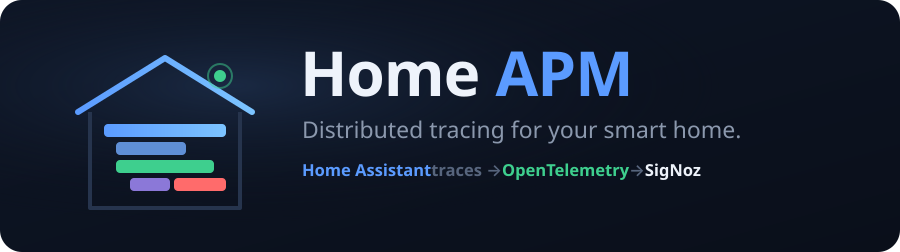
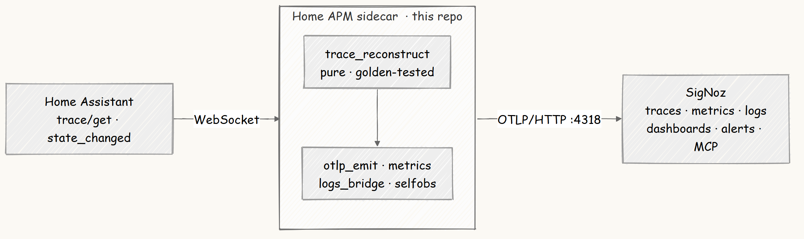
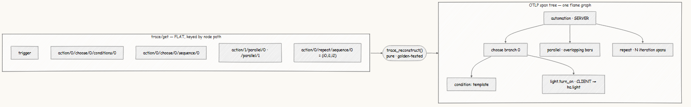

<div align="center">
  
</div>

# Home APM — an APM for your house

<p align="center">
  <a href="https://github.com/wiz-abhi/Home-APM/actions/workflows/ci.yml"></a>
  
  
  
  
  
</p>

<p align="center">
  <b><a href="#how-it-works">How it works</a></b> &nbsp;·&nbsp;
  <b><a href="#see-it">See it</a></b> &nbsp;·&nbsp;
  <b><a href="#ask-your-house">Ask your house</a></b> &nbsp;·&nbsp;
  <b><a href="#quickstart">Quickstart</a></b>
</p>

> **Home Assistant records a full execution trace for every automation — then renders it as an unreadable icon graph.** Home APM turns each run into a real **flame graph in SigNoz**.

<div align="center">
  
</div>

<p align="center"><i>One <code>good_night</code> run: a <code>repeat</code> loop (stacked), a <code>parallel</code> block (overlapping bars), and a red <b>ERROR</b> span — <code>ZeroDivisionError: division by zero</code>.</i></p>

---

## What it is

A small Python **sidecar**. It subscribes to Home Assistant's WebSocket API, pulls
each automation's raw `trace/get` payload, reconstructs it into an OpenTelemetry
span tree, and exports it to self-hosted **SigNoz**. Cryptic node paths like
`conditions/0/conditions/1/conditions/0` become named, clickable spans — with
sensor metrics, correlated logs, a room dashboard, and alerts that fire back into
Home Assistant. HA has **no native OpenTelemetry trace export**; this is it.

## The problem

Home Assistant isn't niche — **2,000,000+ active homes** ([Open Home Foundation, 2025](https://www.home-assistant.io/blog/2025/04/16/state-of-the-open-home-2025/)).
They share one pain: the built-in trace view is, per a developer in a
[22-reply thread](https://community.home-assistant.io/t/767431), *"mostly useless."*
Paths render as cryptic strings, the graph won't scroll, and only ~5 traces are
kept — so the run you need is often *"no longer available."* A
[separate thread](https://community.home-assistant.io/t/795531) asks outright for
OpenTelemetry export, a *"tremendous benefit"* — with no solution today.

Home Assistant's native trace view — icon-only, `runtime: 0.00 s`, *"might not be related"*:

<div align="center">
  
</div>

The same run in SigNoz — a named, timed waterfall with `ha.step_type` · `ha.result` · `ha.node_path`:

<div align="center">
  
</div>

## How it works

<div align="center">
  
</div>

The core is one **pure, I/O-free function** — a `trace/get` payload dict in, a
`list[SpanSpec]` out. That is what makes it golden-testable offline: **clone and
`pytest`, no house required.** Everything else is thin I/O around it.

The trick: HA's payload is a **flat dict keyed by node path**, not a tree.
Rebuilding the tree — with real per-element timestamps, truly-overlapping
`parallel` bars, and `repeat` bodies that arrive as a *list under one key* — is
the moat.

<div align="center">
  
</div>

The span schema is frozen — renaming one key would break the dashboard, the
alerts, and "ask your house" at once. The deliberate `CLIENT`/`SERVER` `span.kind`
pairing is what lets SigNoz draw a **service map of your house**.

**The board** — seven panels titled as plain-English questions, plus a `$room`
selector that refocuses everything:

<div align="center">
  
</div>

Every screenshot here is a real capture from the live stack — a 49.7 s
`wait_for_trigger` span, a 100 % `run_id → trace_id` log join, a SigNoz alert that
routes back into Home Assistant as a notification — none of it staged.

## Ask your house

<div align="center">
  
</div>

```bash
python tools/ask/ask.py "why did my hallway lights turn on at 3am?"
```

`gemini-3.1-flash-lite` reads the question, a **deterministic tool chain** over the
SigNoz MCP server finds the run and pulls its span tree, and a final call narrates
the cause in one sentence — with the exact `trace_id` and a flame-graph link. Every
fact comes from real trace data; the LLM only translates language, with a
heuristic fallback if it's offline.

The **[Console](tools/console)** puts this in a browser — a live-runs table and
one-click deep links into SigNoz — and is the natural **deployed link** for the
project (`python tools/console/server.py`).

## Quickstart

**Offline (no house, no Docker) — the replicability floor:**

```bash
pip install -e ".[dev]"
pytest          # 68 tests — reconstruction verified against real recorded payloads
```

**One command (SigNoz + seeded house + sidecar) via Foundry:**

```bash
foundryctl -f casting.yaml -p pours forge
bash deploy/seed-token.sh                       # inject the seeded HA token
foundryctl -f casting.yaml -p pours cast --no-forge
```

**Already run SigNoz? Just the two app services:**

```bash
bash deploy/seed-token.sh
docker compose -f deploy/docker-compose.fallback.yml up -d --build
```

`casting.yaml` (+ `casting.yaml.lock`) is forge-verified; it enables the SigNoz MCP
server and patches the seeded Home Assistant, the sidecar, and the Console onto the
generated compose. For **BYOH** ("bring your own house"), point `HA_URL` / `HA_TOKEN`
/ `OTLP_ENDPOINT` at your own instance — secrets stay in the gitignored `.ha-runtime/`.
See [`deploy/NOTES.md`](deploy/NOTES.md) for the cross-platform patch-target caveat.

## Engineering

- **68 tests, all green** — the reconstruction is verified against **golden
  fixtures**: real recorded `trace/get` payloads replayed offline.
- **`mypy --strict`** + **`ruff`** lint/format, both enforced in CI on every push.
- **Pure moat** — `trace_reconstruct` is a dependency-free `dict → [SpanSpec]`
  function; all I/O lives outside it.
- **Python 3.11**, four runtime dependencies. No Home Assistant install needed to
  run the tests.

## Honest limits

- **Start times are real; per-step *end* is inferred** — HA carries a real
  `timestamp` per element (so parallel/repeat bars start correctly), but stores no
  per-step end, so a duration is `(next in-scope start − this start)`.
- **Logs↔traces is an id-join, not a native badge** — the sidecar narrates
  `run_id → trace_id` in its own log body (a 100 % join); HA's state logs carry no
  `trace_id`.
- **No tested one-click HAOS add-on** — Supervisor add-ons aren't testable on a
  Docker-Desktop HA, so this ships the sidecar + casting/compose paths only.

## AI-usage disclosure

Built solo with heavy AI assistance (Anthropic's Claude / Claude Code), disclosed
here per the hackathon rules. AI was used to research HA's trace internals, draft
the scaffold and docs, implement and test the reconstruction algorithm, and author
the tooling and screenshot scripts. Every artifact was reviewed, edited, and
**verified against real payloads and a live SigNoz stack** by the author; the design
decisions and the frozen schema are the author's own.

## Prior art

`ha-kafka-net` bridges HA to .NET via Kafka (instruments its *own* framework, not HA's
traces). `detektr` emits OTel spans for *its* CV pipeline. Neither converts Home
Assistant's native `trace/get` node-path payloads into OTLP span trees — that is Home
APM's specific contribution.

---

<div align="center">
  <sub>MIT · built for the <b>Agents of SigNoz</b> hackathon (Track 3) · Home Assistant traces → OpenTelemetry → SigNoz</sub>
</div>
